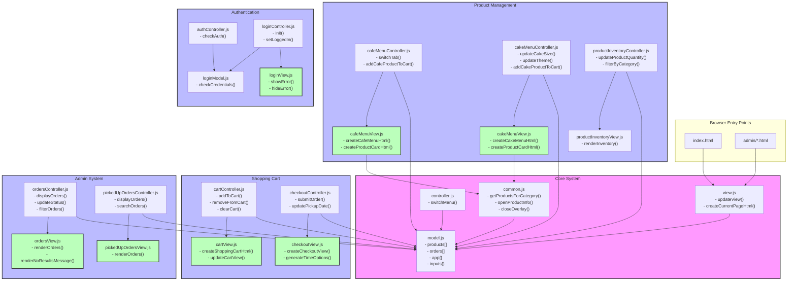

## Nettside Kafè

En nettside hvor kunden skal kunne se gjennom typiske kafe produkter som baguetter, snitter og kaffe, samt kaker.

kunden skal kunne sende en bestilling som må hentes selv. Man skal kunne gjøre enkle tilpasninger på kafe produktene med mer avanserte tilpasninger for kake.

Siste versjon av siden kan testes her:
https://aleanon.github.io/Nettside-kafe/

# Project Architecture

# Fullstendig Funksjonsoversikt

## Kjernesystemfunksjoner

### model.js (Sentral Tilstand)
- `replaceModel(model)`: Oppdaterer modelltilstand
- `calculateCustomCakePrice(themeId, size)`: Beregner kakepriser
- `subtractOrderedQuantityFromUnitsInStock(products)`: Oppdaterer varebeholdning
- `updateOrderStatus(orderId, newStatus)`: Endrer ordrestatus
- `addCustomQuantity(productId, quantity)`: Legger til i varebeholdning

### view.js (Basisvisning)
- `updateView()`: Hovedfunksjon for visningsoppdatering
- `createCurrentPageHtml()`: Genererer innhold for gjeldende side
- Lyttere for historikk og DOM-tilstand

### common.js (Delte Verktøy)
- `getProductsForCategory(category)`: Filtrerer produkter
- `getProductFromId(id)`: Produktoppslag
- `openProductInfo(id)`: Viser produktdetaljer
- `closeOverlay()`: Lukker detaljvisning
- `formatDateTime(dateString, timeString)`: Datoformatering

## Produkthåndtering

### Kafémeny
**Kontroller (cafeMenuController.js)**
- `switchTab(value)`: Endrer menykategori
- `updateCafeProductComment(value)`: Oppdaterer produktnotater
- `addCafeProductToCart(id)`: Legger kaféartikler i handlekurv

**Visning (cafeMenuView.js)**
- `createCafeMenuHtml()`: Rendrer kafémeny
- `createCafeProductCardHtml(product)`: Lager produktkort
- `createProductInfoOverlayElement()`: Produktdetaljvisning

### Kakemeny
**Kontroller (cakeMenuController.js)**
- `updateCakeSize(size)`: Oppdaterer kakestørrelse
- `updateTheme(themeId)`: Endrer kaketema
- `updateFlavor(flavor)`: Setter kakesmak
- `addCakeProductToCart(productId)`: Legger kaker i handlekurv

**Visning (cakeMenuView.js)**
- `createCakeMenuHtml()`: Rendrer kakemeny
- `createCakeProductCardHtml(product)`: Lager kakekort
- `createCakeProductInfoOverlayElement()`: Kakedetaljvisning

## Handlekurv

### Kurvhåndtering
**Kontroller (cartController.js)**
- `addToCart(name, price, productId, quantity, message)`: Legger til i kurv
- `removeFromCart(itemIndex)`: Fjerner fra kurv
- `clearCart()`: Tømmer handlekurven
- `setCartItemQuantity(itemIndex, quantity)`: Endrer antall

**Visning (cartView.js)**
- `createShoppingCartHtml()`: Rendrer handlekurv
- `createCartItemHtml(itemIndex, item)`: Lager kurvartikler
- `showCartNotification(message)`: Viser varsler

### Utsjekking
**Kontroller (checkoutController.js)**
- `goToPickupTime()`: Starter utsjekking
- `updatePickupDate(date)`: Setter hentetidspunkt
- `submitOrder()`: Behandler bestilling

**Visning (checkoutView.js)**
- `createCheckoutView()`: Rendrer utsjekking
- `generateTimeOptions()`: Lager tidsvelger
- `createOrderConfirmation()`: Viser bekreftelse

## Administrasjonssystem

### Ordrehåndtering
**Kontroller (ordersController.js)**
- `displayOrders()`: Viser bestillinger
- `updateStatus(orderId, newStatus)`: Oppdaterer ordrestatus
- `filterOrders()`: Filtrerer ordreliste
- `searchOrders()`: Søker i bestillinger

**Visning (ordersView.js)**
- `renderOrders()`: Viser bestillinger
- `renderNoResultsMessage()`: Viser ingen treff
- `renderOrderedProductsHtml()`: Viser ordredetaljer

### Hentede Bestillinger
**Kontroller (pickedUpOrdersController.js)**
- `displayOrders()`: Viser fullførte bestillinger
- `searchOrders()`: Søker i fullførte bestillinger

**Visning (pickedUpOrdersView.js)**
- `renderOrders()`: Viser fullførte bestillinger

## Autentisering

### Innloggingssystem
**Kontroller (loginController.js)**
- `init()`: Initialiserer innlogging
- `setLoggedIn()`: Setter innloggingstilstand

**Modell (loginModel.js)**
- `checkCredentials(enteredID, enteredPassword)`: Sjekker påloggingsdetaljer

**Visning (loginView.js)**
- `showError()`: Viser innloggingsfeil
- `hideError()`: Skjuler feilmeldinger
- `togglePasswordVisibility()`: Håndterer passordvisning

### Autentiseringskontroller (authController.js)
- Håndterer øktadministrasjon
- Omdirigerer uautorisert tilgang
