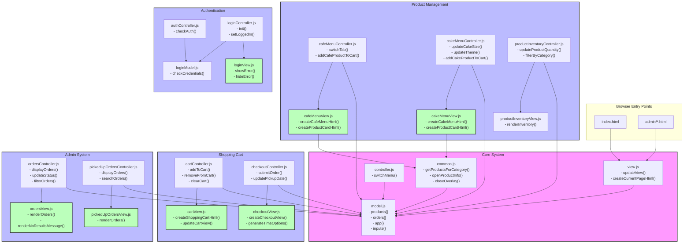
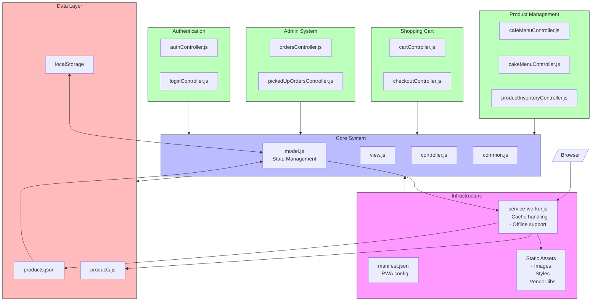

## Nettside Kafè

En nettside hvor kunden skal kunne se gjennom typiske kafe produkter som baguetter, snitter og kaffe, samt kaker.

kunden skal kunne sende en bestilling som må hentes selv. Man skal kunne gjøre enkle tilpasninger på kafe produktene med mer avanserte tilpasninger for kake.

Siste versjon av siden kan testes her:
https://aleanon.github.io/Nettside-kafe/

# Project Architecture


# Fullstendig Funksjonsoversikt

## Kjernesystemfunksjoner

### model.js (Sentral Tilstand)
- `replaceModel(model)`: Oppdaterer modelltilstand
- `calculateCustomCakePrice(themeId, size)`: Beregner kakepriser
- `subtractOrderedQuantityFromUnitsInStock(products)`: Oppdaterer varebeholdning
- `updateOrderStatus(orderId, newStatus)`: Endrer ordrestatus
- `addCustomQuantity(productId, quantity)`: Legger til i varebeholdning

### view.js (Basisvisning)
- `updateView()`: Hovedfunksjon for visningsoppdatering
- `createCurrentPageHtml()`: Genererer innhold for gjeldende side
- Lyttere for historikk og DOM-tilstand

### common.js (Delte Verktøy)
- `getProductsForCategory(category)`: Filtrerer produkter
- `getProductFromId(id)`: Produktoppslag
- `openProductInfo(id)`: Viser produktdetaljer
- `closeOverlay()`: Lukker detaljvisning
- `formatDateTime(dateString, timeString)`: Datoformatering

## Produkthåndtering

### Kafémeny
**Kontroller (cafeMenuController.js)**
- `switchTab(value)`: Endrer menykategori
- `updateCafeProductComment(value)`: Oppdaterer produktnotater
- `addCafeProductToCart(id)`: Legger kaféartikler i handlekurv

**Visning (cafeMenuView.js)**
- `createCafeMenuHtml()`: Rendrer kafémeny
- `createCafeProductCardHtml(product)`: Lager produktkort
- `createProductInfoOverlayElement()`: Produktdetaljvisning

### Kakemeny
**Kontroller (cakeMenuController.js)**
- `updateCakeSize(size)`: Oppdaterer kakestørrelse
- `updateTheme(themeId)`: Endrer kaketema
- `updateFlavor(flavor)`: Setter kakesmak
- `addCakeProductToCart(productId)`: Legger kaker i handlekurv

**Visning (cakeMenuView.js)**
- `createCakeMenuHtml()`: Rendrer kakemeny
- `createCakeProductCardHtml(product)`: Lager kakekort
- `createCakeProductInfoOverlayElement()`: Kakedetaljvisning

## Handlekurv

### Kurvhåndtering
**Kontroller (cartController.js)**
- `addToCart(name, price, productId, quantity, message)`: Legger til i kurv
- `removeFromCart(itemIndex)`: Fjerner fra kurv
- `clearCart()`: Tømmer handlekurven
- `setCartItemQuantity(itemIndex, quantity)`: Endrer antall

**Visning (cartView.js)**
- `createShoppingCartHtml()`: Rendrer handlekurv
- `createCartItemHtml(itemIndex, item)`: Lager kurvartikler
- `showCartNotification(message)`: Viser varsler

### Utsjekking
**Kontroller (checkoutController.js)**
- `goToPickupTime()`: Starter utsjekking
- `updatePickupDate(date)`: Setter hentetidspunkt
- `submitOrder()`: Behandler bestilling

**Visning (checkoutView.js)**
- `createCheckoutView()`: Rendrer utsjekking
- `generateTimeOptions()`: Lager tidsvelger
- `createOrderConfirmation()`: Viser bekreftelse

## Administrasjonssystem

### Ordrehåndtering
**Kontroller (ordersController.js)**
- `displayOrders()`: Viser bestillinger
- `updateStatus(orderId, newStatus)`: Oppdaterer ordrestatus
- `filterOrders()`: Filtrerer ordreliste
- `searchOrders()`: Søker i bestillinger

**Visning (ordersView.js)**
- `renderOrders()`: Viser bestillinger
- `renderNoResultsMessage()`: Viser ingen treff
- `renderOrderedProductsHtml()`: Viser ordredetaljer

### Hentede Bestillinger
**Kontroller (pickedUpOrdersController.js)**
- `displayOrders()`: Viser fullførte bestillinger
- `searchOrders()`: Søker i fullførte bestillinger

**Visning (pickedUpOrdersView.js)**
- `renderOrders()`: Viser fullførte bestillinger

## Autentisering

### Innloggingssystem
**Kontroller (loginController.js)**
- `init()`: Initialiserer innlogging
- `setLoggedIn()`: Setter innloggingstilstand

**Modell (loginModel.js)**
- `checkCredentials(enteredID, enteredPassword)`: Sjekker påloggingsdetaljer

**Visning (loginView.js)**
- `showError()`: Viser innloggingsfeil
- `hideError()`: Skjuler feilmeldinger
- `togglePasswordVisibility()`: Håndterer passordvisning

### Autentiseringskontroller (authController.js)
- Håndterer øktadministrasjon
- Omdirigerer uautorisert tilgang



# Systemarkitektur

## Infrastruktur og Hovedkomponenter

### Service Worker
Service workeren (`service-worker.js`) er sentral for applikasjonens offline-funksjonalitet og ytelse:
- Cacher statiske ressurser for offline-bruk
- Håndterer nettverksforespørsler med ulike strategier
- Versjonskontroll av cache
- Optimaliserer lasting av ressurser

### PWA-konfigurasjon
`manifest.json` definerer Progressive Web App-funksjonaliteter:
- App-ikon og splash-screens
- Installasjonsmuligheter
- Tema- og fargeinnstillinger

## Kjernesystem

### Modell (model.js)
Sentral tilstandshåndtering for:
- Produktkatalog
- Ordre og bestillinger
- Brukerinnstillinger
- Handlevogn

### Visning (view.js)
Basis-visningshåndtering:
- Hovedoppdateringer av GUI
- Sidenavigasjon
- DOM-manipulasjon

### Kontroller (controller.js)
Koordinerer brukerinteraksjoner:
- Hendelseshåndtering
- Forretningslogikk
- Tilstandsoppdateringer

## Moduler

### Produkthåndtering
- **Kafémeny**: Visning og bestilling av kaféprodukter
- **Kakemeny**: Spesialisert for kakebestillinger og tilpasninger
- **Lagerstyring**: Administrasjon av varebeholdning

### Handlevogn
- Produkthåndtering i kurv
- Bestillingsprosess
- Hentetidsbestilling
- Betalingshåndtering

### Administrasjon
- Ordrebehandling
- Bestillingsoversikt
- Produktadministrasjon
- Statistikk og rapporter

### Autentisering
- Innlogging for ansatte
- Sesjonshåndtering
- Tilgangskontroll

## Datalag

### Lokal Lagring
- Produktdata i JSON-format
- Handlevogndata i localStorage
- Brukerinnstillinger

### Backend-integrasjon
- REST API-integrasjon
- Sanntidsoppdateringer
- Datasynkronisering

## Tekniske Detaljer

### Cachingstrategier
1. **Statiske Ressurser**
   - Full caching av bilder, stiler, scripts
   - Versjonskontroll med cache-busting

2. **API-responser**
   - Cache-then-network strategi
   - Fallback til cached data offline

3. **Dynamisk Innhold**
   - Selektiv caching basert på innholdstype
   - Periodisk oppdatering av cache

### Ytelsesoptimalisering
- Lazy loading av bilder
- Minifiserte ressurser
- Effektiv DOM-manipulasjon
- Progressive enhancement

## Avhengigheter
- dayjs: Datohåndtering
- DOMPurify: XSS-beskyttelse
- Moderne nettleserstøtte påkrevd

## Utvikling og Deployment
- Gulp for building og minifisering
- Jest for testing
- ESLint/Prettier for kodeformatering
- GitHub Actions for CI/CD

# Prosjektinfrastruktur

## Byggeverktøy og Konfigurasjon

### Gulp (gulpfile.js)
Håndterer byggeprosessen:
```javascript
// Hovedoppgaver
- combine-main-css    // Kombinerer CSS-filer
- combine-admin-css   // Kombinerer admin CSS
- combine-main-js     // Bundler hovedscripts
- uglify-admin-js     // Minifiserer admin-scripts
- uglify-auth-js      // Minifiserer auth-scripts
- uglify-product-js   // Minifiserer produkt-scripts
- copy-files          // Kopierer statiske filer
```

### Babel (.babelrc)
JavaScript kompilering:
```json
{
  "presets": ["@babel/preset-env"]
}
```

### ESLint (eslint.config.mjs)
Kodestandard og linting:
- Google style guide
- Prettier integrasjon
- Customiserte regler

### Prettier (.prettierrc)
Kodeformatering:
```json
{
  "trailingComma": "all",
  "tabWidth": 2,
  "singleQuote": true
}
```

## GitHub Workflows

### build_n_deploy.yml
```yaml
name: Build and Deploy
on:
  push:
    branches: [main]
jobs:
  - Sjekker repository
  - Bygger prosjektet
  - Deployer til GitHub Pages
```

### publish.yml
```yaml
name: Deploy to GitHub Pages
on:
  push:
    branches: [1.0.0-beta]
```

## Progressive Web App

### manifest.json
```json
{
  "name": "Bakst og Brygg",
  "start_url": "/Nettside-kafe/index.html",
  "display": "standalone"
}
```

### service-worker.js
- Cache-håndtering
- Offline støtte
- Ressursoptimalisering

## Prosjektstruktur

### Rotkatalog
```
├── package.json        # Prosjektavhengigheter
├── gulpfile.js        # Byggekonfigurasjon
├── .babelrc           # Babel-konfigurasjon
├── .editorconfig      # Editor-innstillinger
├── .gitattributes     # Git-filhåndtering
├── .gitignore         # Git-ignoreringer
├── .prettierrc        # Kodeformatering
├── eslint.config.mjs  # Linting-regler
├── jest.config.js     # Test-konfigurasjon
└── jsdoc.json         # Dokumentasjonsgenerering
```

### GitHub Workflows
```
.github/workflows/
├── build_n_deploy.yml
└── publish.yml
```

## NPM Scripts (package.json)
```json
{
  "scripts": {
    "build": "gulp",
    "lint": "eslint ./src",
    "format": "prettier --write ./src",
    "doc": "jsdoc -c jsdoc.json",
    "test": "jest"
  }
}
```

## Testing og Dokumentasjon
- Jest for enhetstesting
- JSDoc for dokumentasjon
- Testing av:
  - Menu Controller
  - View
  - Café Menu View

## Deployment
GitHub Pages via Actions:
1. Bygger prosjektet med Gulp
2. Kjører tester
3. Genererer dokumentasjon
4. Deployer til GitHub Pages

## Avhengigheter
Hovedavhengigheter:
- Gulp for bygging
- Babel for JS-kompilering
- ESLint/Prettier for kodeformatering
- Jest for testing
- Firebase for backend
- Express for lokal utvikling

Utviklingsavhengigheter er definert i package.json

## Miljøkonfigurasjon
- .editorconfig for konsistent koding
- .gitattributes for linjeskift
- .gitignore for versjonskontr

## Prosjektstruktur
#update_structure_start#

#update_structure_end#

## Arkitektur

#update_architecture_start#
...
#update_architecture_end#
