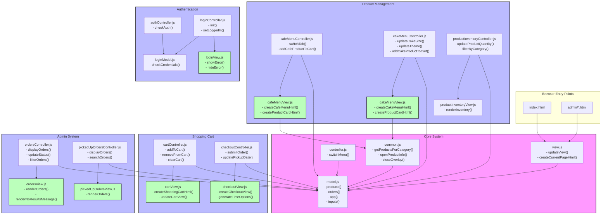

## Nettside Kafè

En nettside hvor kunden skal kunne se gjennom typiske kafe produkter som baguetter, snitter og kaffe, samt kaker.

kunden skal kunne sende en bestilling som må hentes selv. Man skal kunne gjøre enkle tilpasninger på kafe produktene med mer avanserte tilpasninger for kake.

Siste versjon av siden kan testes her:
https://aleanon.github.io/Nettside-kafe/

# Project Architecture

